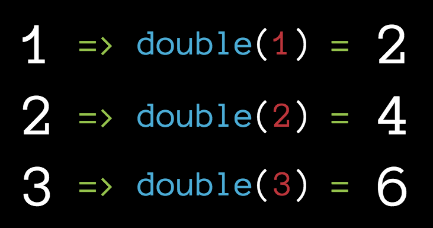

# 04 - map

The `map()` method on the Array prototype creates a new array with the results of calling a provided function on every element in the calling array. `map` is a higher order function.

* The call to `map()` will return a new array
* The return value of the callback function used with map will appear in the new array



## Map written with a forEach

```js
let numbers = [1, 2, 3];
let doubledNumbers = []; // 1. Initialize accumulator variable

// 2. Iterate over an array
numbers.forEach((number) => {
  doubledNumbers.push(number * 2); // 3. Update the accumulator variable
})

console.log(doubledNumbers);
```

The same code written with a map instead of a forEach

```js
let numbers = [1, 2, 3];

let doubledNumbers = numbers.map((number) => {
  return number * 2;
});

console.log(doubledNumbers);
```

We could also store the function in a variable:

```js
const double = (number) => {
  return number * 2;
};

let numbers = [1, 2, 3];

let doubledNumbers = numbers.map(double);

console.log(doubledNumbers);
```

The callback function passed into the `map` will get called with 3 parameters:

1. The element value
2. The element index
3. The array map was called upon

```js
let numbers = [1, 2, 3];

let doubledNumbers = numbers.map((number, index, array) => {
  console.log(number, 'is the', index, 'in the array:', array);  
  return number * 2;
});

console.log(doubledNumbers);
```

## When to use Map:

* When you want a new array of the same length with some operation performed on each array value

## Resources

* [MDN: Array.prototype.map](https://developer.mozilla.org/en-US/docs/Web/JavaScript/Reference/Global_Objects/Array/map)