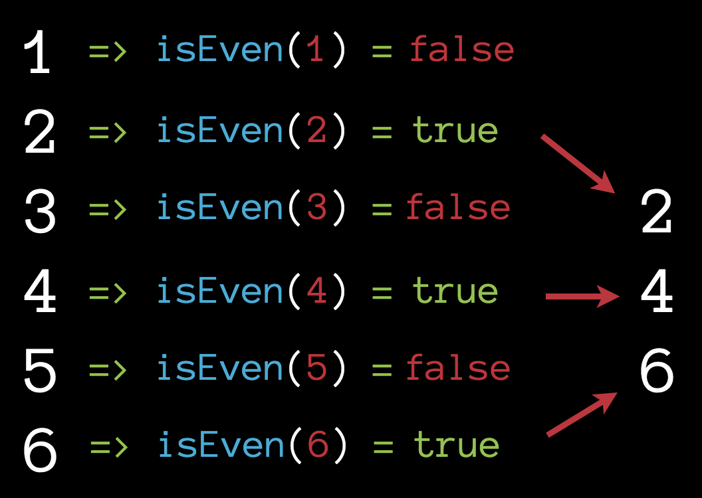

# 05 - filter

The `filter()` method creates a new array with all elements that pass the test implemented by the provided function. `filter` is a higher order function.

* The call to `filter()` will return a new array
* The callback function used with `filter` should either return `true` or `false` 
  * `true` if the current element should appear in the new array
  * `false` if the current element should NOT appear in the new array



## Filter written with a forEach

```js
let numbers = [1, 2, 3, 4, 5, 6, 7, 8, 9, 10];
let evenNumbers = []; // 1. Initialize accumulator variable

// 2. Iterate over an array
numbers.forEach((number) => {
  if (number % 2 === 0) {
    evenNumbers.push(number); // 3. Update the accumulator variable
  }
});

console.log(evenNumbers);
```

The same code written with a filter instead of a forEach

```js
let numbers = [1, 2, 3, 4, 5, 6, 7, 8, 9, 10];

let evenNumbers = numbers.filter((number) => {
  return number % 2 === 0;
});

console.log(evenNumbers);
```

We could also store the function in a variable:

```js
const isEven = (number) => {
  return number % 2 === 0;
};

let numbers = [1, 2, 3, 4, 5, 6, 7, 8, 9, 10];

let evenNumbers = numbers.filter(isEven);

console.log(evenNumbers);
```

The callback function passed into the `filter` will get called with 3 parameters:

1. The element value
2. The element index
3. The array filter was called upon

```js
let numbers = [1, 2, 3, 4, 5, 6, 7, 8, 9, 10];

let evenNumbers = numbers.filter((number) => {
  console.log(number, 'is the', index, 'in the array:', array);  
  return number % 2 === 0;
});

console.log(evenNumbers);
```

## When to use Filter:

* When you want a new array of a different length, based on some condition that only some elements in the array satisfy

## Resources

* [MDN: Array.prototype.filter](https://developer.mozilla.org/en-US/docs/Web/JavaScript/Reference/Global_Objects/Array/filter)