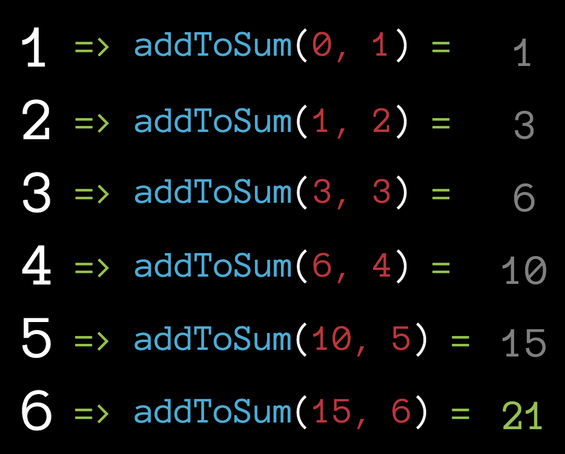

# 05 - reduce

The `reduce()` method applies a function against an accumulator and each element in the array (from left to right) to reduce it to a single value. `reduce` is a higher order function.

* The call to `reduce()` will return a single value
* The callback function used with `reduce` will get passed the accumulator value and an element in the array
  * The accumulator value is the value returned from the last call to the callback function
  * The callback function should always return a value to be used in the next callback
* The third argument to the `reduce()` function is the starting value for the accumulator



## reduce written with a forEach

```js
let numbers = [1, 2, 3, 4, 5];

let sum = 0; // 1. Initialize accumulator variable

// 2. Iterate over an array
numbers.forEach((number) => {
  sum += number; // 3. Update the accumulator variable
});

console.log(sum);
```

The same code written with a reduce instead of a forEach

```js
let numbers = [1, 2, 3, 4, 5];

// 2. Iterate over an array
let sum = numbers.reduce((sum, number) => { // sum will be the previously returned accumulator value
  sum += number; // 3. Update the accumulator variable
  return sum; // Always return the accumulator
}, 0); // 1. Initialize accumulator variable

console.log(sum);
```

We could also store the function in a variable:

```js
const addToSum = (sum, number) => {
  sum += number;
  return sum;
};

let numbers = [1, 2, 3, 4, 5];
let sum = numbers.reduce(addToSum, 0);
console.log(sum);
```

The callback function passed into the `reduce` will get called with 4 parameters:

1. The accumulator value
2. The element value
3. The element index
4. The array reduce was called upon

```js
let numbers = [1, 2, 3, 4, 5];

let sum = numbers.reduce((sum, number, index, array) => {
console.log(number, 'is the', index, 'in the array:', array);  
  sum += number;
  return sum;
}, 0);

console.log(sum);
```

## When to use Reduce:

* When you want a new single value, based on the values in the array.

## Resources

* [MDN: Array.prototype.reduce](https://developer.mozilla.org/en-US/docs/Web/JavaScript/Reference/Global_Objects/Array/Reduce)